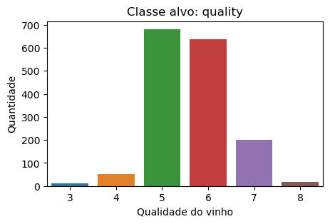
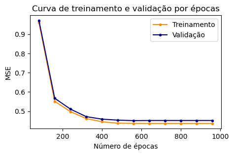
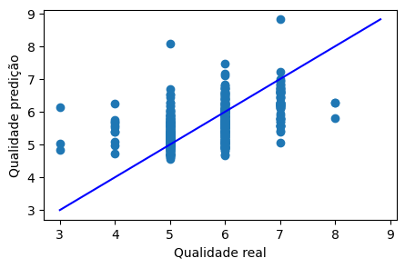

# Multi-Layer-Perceptron-with-k-Fold-Validation
Utilização do banco de dados “winequality-red” para abordar o problema de regressão utilizando uma rede neural MLP de duas camadas com o método de validação cruzada k-Fold para avaliar o treinamento do modelo.


<font size="3"><b> Importação do banco de dados "winequality" para a regressão utilizando Multilayer Perceptron (MLP) com método de validação cruzada k-fold.</b>  </font>  


```python
import pandas as pd
import numpy as np
import matplotlib.pyplot as plt
import seaborn as sns
from sklearn.model_selection import train_test_split
from statistics import mean
from sklearn.metrics import accuracy_score 
from sklearn.metrics import explained_variance_score as evs
from sklearn.metrics import mean_squared_error
from sklearn.neural_network import MLPRegressor

dadosVinho = pd.read_csv('./winequality-red.csv')

print("Quantidade de objetos do banco de dados:", dadosVinho.shape[0])
print("Quantidade de atributos do banco de dados:", dadosVinho.shape[1])

dadosVinho.sample(5)
```

    Quantidade de objetos do banco de dados: 1599
    Quantidade de atributos do banco de dados: 12
    


<div>
  
<table border="1" class="dataframe">
  <thead>
    <tr style="text-align: right;">
      <th></th>
      <th>fixed acidity</th>
      <th>volatile acidity</th>
      <th>citric acid</th>
      <th>residual sugar</th>
      <th>chlorides</th>
      <th>free sulfur dioxide</th>
      <th>total sulfur dioxide</th>
      <th>density</th>
      <th>pH</th>
      <th>sulphates</th>
      <th>alcohol</th>
      <th>quality</th>
    </tr>
  </thead>
  <tbody>
    <tr>
      <th>1331</th>
      <td>7.8</td>
      <td>0.87</td>
      <td>0.26</td>
      <td>3.8</td>
      <td>0.107</td>
      <td>31.0</td>
      <td>67.0</td>
      <td>0.99668</td>
      <td>3.26</td>
      <td>0.46</td>
      <td>9.2</td>
      <td>5</td>
    </tr>
    <tr>
      <th>906</th>
      <td>7.2</td>
      <td>0.54</td>
      <td>0.27</td>
      <td>2.6</td>
      <td>0.084</td>
      <td>12.0</td>
      <td>78.0</td>
      <td>0.99640</td>
      <td>3.39</td>
      <td>0.71</td>
      <td>11.0</td>
      <td>5</td>
    </tr>
    <tr>
      <th>552</th>
      <td>9.5</td>
      <td>0.46</td>
      <td>0.24</td>
      <td>2.7</td>
      <td>0.092</td>
      <td>14.0</td>
      <td>44.0</td>
      <td>0.99800</td>
      <td>3.12</td>
      <td>0.74</td>
      <td>10.0</td>
      <td>6</td>
    </tr>
    <tr>
      <th>1283</th>
      <td>8.7</td>
      <td>0.63</td>
      <td>0.28</td>
      <td>2.7</td>
      <td>0.096</td>
      <td>17.0</td>
      <td>69.0</td>
      <td>0.99734</td>
      <td>3.26</td>
      <td>0.63</td>
      <td>10.2</td>
      <td>6</td>
    </tr>
    <tr>
      <th>434</th>
      <td>10.4</td>
      <td>0.41</td>
      <td>0.55</td>
      <td>3.2</td>
      <td>0.076</td>
      <td>22.0</td>
      <td>54.0</td>
      <td>0.99960</td>
      <td>3.15</td>
      <td>0.89</td>
      <td>9.9</td>
      <td>6</td>
    </tr>
  </tbody>
</table>
</div>


 <br>
<font size="4">  
    <b >Histograma da classe alvo quality</b>
</font> 


```python

fig1,figuraQualidade = plt.subplots(figsize=(5,3))
sns.countplot(x = dadosVinho['quality'])
figuraQualidade.set_xlabel('Qualidade do vinho')
figuraQualidade.set_ylabel('Quantidade')
figuraQualidade.set_title('Classe alvo: quality')
```


    Text(0.5, 1.0, 'Classe alvo: quality')


    

    


Podemos observar que a classe está altamente concentrada em dois valores, assim havendo um desbalanceamento que pode influenciar no desempenho da regressão.

 <br>
<font size="4">  
    <b>Normalização dos dados</b>
</font> 


```python
from sklearn import preprocessing

x = dadosVinho.drop(['quality'], axis = 1)

arrayNormalizacao = preprocessing.normalize(x)
dadosNormalizados = pd.DataFrame(arrayNormalizacao, columns = x.columns)
dadosNormalizados.sample(5)
```


<div>

<table border="1" class="dataframe">
  <thead>
    <tr style="text-align: right;">
      <th></th>
      <th>fixed acidity</th>
      <th>volatile acidity</th>
      <th>citric acid</th>
      <th>residual sugar</th>
      <th>chlorides</th>
      <th>free sulfur dioxide</th>
      <th>total sulfur dioxide</th>
      <th>density</th>
      <th>pH</th>
      <th>sulphates</th>
      <th>alcohol</th>
    </tr>
  </thead>
  <tbody>
    <tr>
      <th>1482</th>
      <td>0.441968</td>
      <td>0.035603</td>
      <td>0.033148</td>
      <td>0.128907</td>
      <td>0.006998</td>
      <td>0.184153</td>
      <td>0.552460</td>
      <td>0.061212</td>
      <td>0.204410</td>
      <td>0.034989</td>
      <td>0.632260</td>
    </tr>
    <tr>
      <th>1254</th>
      <td>0.182745</td>
      <td>0.016400</td>
      <td>0.001406</td>
      <td>0.044515</td>
      <td>0.001851</td>
      <td>0.468577</td>
      <td>0.820010</td>
      <td>0.023342</td>
      <td>0.079658</td>
      <td>0.016166</td>
      <td>0.255374</td>
    </tr>
    <tr>
      <th>295</th>
      <td>0.345290</td>
      <td>0.015986</td>
      <td>0.014707</td>
      <td>0.079928</td>
      <td>0.002334</td>
      <td>0.159856</td>
      <td>0.863224</td>
      <td>0.031974</td>
      <td>0.097512</td>
      <td>0.020462</td>
      <td>0.303727</td>
    </tr>
    <tr>
      <th>1486</th>
      <td>0.243475</td>
      <td>0.024347</td>
      <td>0.007519</td>
      <td>0.075191</td>
      <td>0.002506</td>
      <td>0.322246</td>
      <td>0.823518</td>
      <td>0.035643</td>
      <td>0.121021</td>
      <td>0.021483</td>
      <td>0.368793</td>
    </tr>
    <tr>
      <th>1424</th>
      <td>0.299436</td>
      <td>0.009380</td>
      <td>0.013348</td>
      <td>0.050507</td>
      <td>0.002742</td>
      <td>0.288613</td>
      <td>0.829761</td>
      <td>0.035983</td>
      <td>0.117610</td>
      <td>0.025254</td>
      <td>0.346335</td>
    </tr>
  </tbody>
</table>
</div>


 <br>
<font size="4">  
    <b>Separação da classe alvo</b>
</font> 


```python
y = dadosVinho['quality']
```

<br>
<font size="4">  
    <b>MLP regressor com 12 neurônios na camada escondida e 1 neurônio na camada de saida</b>
</font> 


```python
mlp = MLPRegressor(hidden_layer_sizes = (12), 
                    random_state=3, 
                    activation = 'relu')
```

<br>
<font size="4">  
    <b>Separação 70% do banco de dados para treinamento e 30% para teste</b>
</font> 


```python
train_X, test_X, train_y, test_y = train_test_split(x, y, test_size = 0.3, random_state = 20)
```

<br>
<font size="4">  
    <b>Validação cruzada k-fold, com 5 partições (k = 5)</b>
</font> 

Com o método k-fold, podemos plotar a curva de perda a decorrer das épocas utilizando a métrica para regressão Erro Quadrático Médio (MSE). Esse método nos ajuda a estimar o desempenho do modelo.


```python
from sklearn.model_selection import KFold
from sklearn.model_selection import cross_val_score
from sklearn.model_selection import validation_curve
import warnings
warnings.filterwarnings("ignore")


param_range = np.arange(0,1000,80) 
k = 5
kfold  = KFold(n_splits = k , shuffle=True)

train_scores, test_scores = validation_curve(
                            mlp, train_X, train_y, param_name="max_iter", param_range=param_range,
                            scoring="neg_mean_squared_error", cv=kfold)

train_scores_mean = -np.mean(train_scores, axis=1)
test_scores_mean = -np.mean(test_scores, axis=1)
train_scores_std = np.std(train_scores, axis=1)
test_scores_std = np.std(test_scores, axis=1)


plt.figure(figsize=(5, 3))
plt.title("Curva de treinamento e validação por épocas")
plt.xlabel("Número de épocas")
plt.ylabel("MSE")

plt.plot(param_range, train_scores_mean, label="Treinamento", color="darkorange", marker='.')
plt.plot(param_range, test_scores_mean, label="Validação", color="navy", marker='.')
plt.legend(loc="best")
plt.show()

```


    

    


O gráfico acima está iterando percorrendo de 0 a 1000 épocas em intervalos de 80 épocas calculando seu MSE. 

Podemos observar que o modelo converge e permanece constante com a diferença de erro pequena entre as curvas de validação e treinamento a partir de 450 épocas aproximadamente.


<br>
<font size="4">  
    <b>Erro quadrático médio com banco de dados teste:</b>
</font> 


```python
mlp.fit(train_X,train_y)
pred = mlp.predict(test_X)
print("Erro quadrático médio:", mean_squared_error(test_y, pred))

```

    Erro quadrático médio: 0.4881707241720792
    

<br>
<font size="4">  
    <b>Erro absoluto médio com banco de dados teste:</b>
</font> 


```python
from sklearn.metrics import mean_absolute_error

print("Erro absoluto médio:", mean_absolute_error(test_y, pred))

```

    Erro absoluto médio: 0.5242629921217307
    

A escala da classe alvo quality é (3,4,5,6,7,8). Então esses erros calculados são razoáveis, considerando o desbalanceamento da classe.

<br>
<font size="4">  
    <b>Comparação quality real vs quality treinado:</b>
</font> 


```python
fig1,figPredicao = plt.subplots(figsize=(5,3))
figPredicao.scatter(test_y,pred, marker="o")
p1 = max(max(pred), max(test_y))
p2 = min(min(pred), min(test_y))

figPredicao.plot([p1, p2], [p1, p2], 'b-')
figPredicao.set_xlabel('Qualidade real')
figPredicao.set_ylabel('Qualidade predição')
figPredicao.set_title('')
```


    Text(0.5, 1.0, '')


    

    


Com o gráfico acima, conseguimos visualizar que a maior concentração das predições com menor erro estão entre os valores 5 e 6. Esse fenômeno ocasionado pelo desbalanceamento. 

Algumas predições foram calculadas com erro elevado em comparação com o valor real.


<br>
<font size="4">  
    <b>Uma predição exemplo com o modelo treinado:</b>
</font> 


```python
#Dados do objeto nº 407

fixedAcidity = 12.00000
volatileAcidity = 0.39000
citricAcid = 0.66000
residualSugar = 3.00000
chlorides = 0.09300
freeSulfurDioxide = 12.00000
totalSulfurDioxide = 30.00000
density = 0.99960
pH = 3.18000
sulphates = 0.63000
alcohol = 10.80000
mlp.fit(train_X, train_y)

predicao = mlp.predict([[fixedAcidity,volatileAcidity,citricAcid,residualSugar,
                                 chlorides,freeSulfurDioxide,totalSulfurDioxide,
                                 density,pH,sulphates,alcohol],])

print("Qualidade do vinho (tabela): ", test_y[407])
print("Qualidade do vinho (resultado regressão MLP): ", predicao)

```

    Qualidade do vinho (tabela):  7
    Qualidade do vinho (resultado regressão MLP):  [6.10761965]
    

Por tanto, como a classe alvo está desbalanceada, algumas predições obtiveram maiores erros, como por exemplo o apresentado acima.
Para diminuir esse MSE e consequentemente melhorar o desempenho da regressão nesse modelo, o balanceamento da classe alvo é necessário, pois o modelo irá tender o resultado para as classes com maior frequência (quality = 5 e quality = 6).

Ou seja, o modelo irá atender bem na média para objetos que estão próximos dos valores relacionados a quality = 5 e 6.


